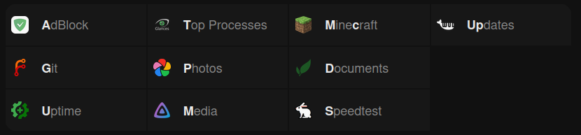

# Tilde

Tilde is a minimal browser homepage for pro web surfers.

## Usage

**To go to a site**, type the corresponding key and press <kbd>Enter</kbd>.

e.g. `g` <kbd>Enter</kbd> will redirect you to
[github.com](https://github.com)

**To search a site**, type a space after the site&rsquo;s key followed by your
query.

e.g. `y kittens` <kbd>Enter</kbd> will
[search YouTube for kittens](https://www.youtube.com/results?search_query=kittens)

**If your input doesn&rsquo;t match a key**, a DuckDuckGo search will be
triggered.

e.g. `google` <kbd>Enter</kbd> will
[search DuckDuckGo for google](https://duckduckgo.com/?q=google)

**To go to a specific path on a site**, type the path after the site&rsquo;s
key.

e.g. `r/r/startpages` <kbd>Enter</kbd> will redirect you to
[reddit.com/r/startpages](https://www.reddit.com/r/startpages)

**To access any other site**, enter the URL directly.

e.g. `example.com` <kbd>Enter</kbd> will redirect you to
[example.com](https://example.com)

## Beyond

Tilde is meant to be customized&mdash;[make it yours!](index.html)

### My Changes

I have made the following changes to the original Tilde, feel free to port them to your fork:
- Commands are fetched from `commands.json` instead of being hardcoded in `index.html`
- Added an optional `icon` field to commands, which refers to an PNG from [dashboard-icons](https://github.com/walkxcode/dashboard-icons)
  - This is shown on the left, replacing the shortcut
- Highlight shortcuts in the command name instead of alongside it
  - This means that, for example, the command named Minecraft with shortcut `mc` will be displayed as **M**ine**c**raft

## License

Use and modify Tilde [as you see fit](UNLICENSE).
